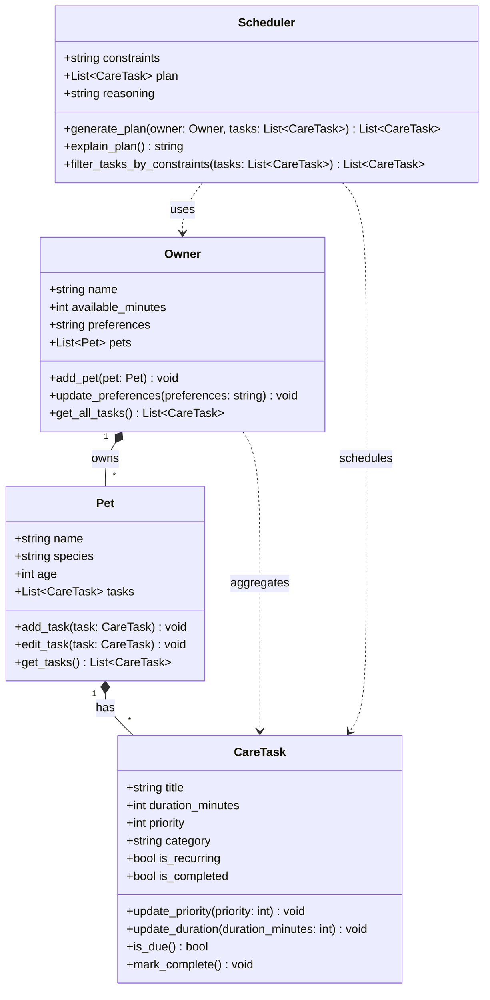

# PawPal+ System Architecture - UML Class Diagram

## Mermaid.js Diagram

## Relationships

- **Owner → Pet** (Composition): An Owner owns multiple Pets. Pets are managed by the Owner.
- **Pet → CareTask** (Composition): A Pet has multiple CareTasks. Tasks belong to specific pets.
- **Scheduler → Owner** (Dependency): Scheduler uses Owner data to generate plans.
- **Scheduler → CareTask** (Dependency): Scheduler operates on CareTask objects.
- **Owner → CareTask** (Aggregation): Owner aggregates tasks from all pets via `get_all_tasks()`.

## Key Design Patterns

1. **Data Classes**: Using Python's `@dataclass` decorator for clean, immutable-by-default data structures
2. **Single Responsibility**: Each class has one clear purpose
3. **Separation of Concerns**: Business logic (Scheduler) separated from data models (Pet, Owner, CareTask)
4. **Composition over Inheritance**: Using composition to build complex relationships

## Algorithm: Priority-Based Greedy Scheduler

**Input:** Owner with available_minutes, List of CareTasks
**Output:** Optimized list of scheduled tasks

**Steps:**
1. Filter tasks by constraints (if any)
2. Filter out completed non-recurring tasks (`is_due()` check)
3. Sort remaining tasks by priority (descending)
4. Greedily select tasks that fit within time budget
5. Generate reasoning explanation

**Time Complexity:** O(n log n) - dominated by sorting
**Space Complexity:** O(n) - storing filtered and scheduled tasks
